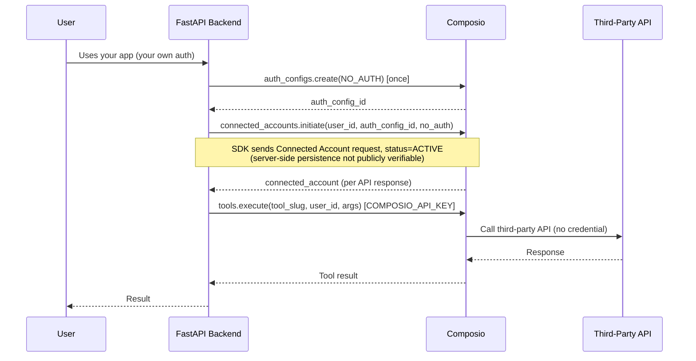

# Composio NO_AUTH — Task Brief
### Task: "Users connect Composio; the connection must be authenticated/managed by Composio itself. Understand exactly how NO_AUTH configs are handled."

Source: the prior research report only. No new lookups performed. Evidence tags carried over unchanged: **[CONFIRMED]**, **[STRONG EVIDENCE]**, **[INFERENCE]**, **[UNKNOWN]**.

---

## 1. What is Composio?

A hosted layer that sits between your backend and third-party APIs (Gmail, GitHub, Slack, etc., plus NO_AUTH toolkits). It owns two things your platform doesn't have to build: (a) the auth relationship with each third-party toolkit, per user, and (b) the tool-execution boundary that runs the actual API call. **[CONFIRMED — from report section A/C]**

## 2. Basic flow: Python → API Key → Composio → Toolkit → Tool

```
Your FastAPI backend
   → authenticates to Composio with COMPOSIO_API_KEY (backend-only)
      → Composio resolves: userID → Auth Config → Connected Account
         → Composio calls the Toolkit (third-party service)
            → Toolkit exposes Tools (e.g. GITHUB_CREATE_ISSUE)
               → tools.execute() runs one Tool and returns a result
```
`COMPOSIO_API_KEY` authenticates *your backend to Composio*. It is a separate layer from whatever authenticates *the toolkit to the third party*. **[CONFIRMED — report section C, "What Composio does"]**

## 3. What is an Auth Config?

A per-toolkit blueprint stored in Composio that defines how that toolkit authenticates: the `auth_scheme` (OAuth2, API_KEY, BASIC, NO_AUTH, etc.) and any credentials. One Auth Config is created once per toolkit and reused for every user who connects it. **[CONFIRMED — report section F, `auth_configs.py` findings]**

## 4. What exactly does NO_AUTH mean?

NO_AUTH is one specific value of `auth_scheme` — not a toggle that removes the Connected Account object, not an absence of authentication infrastructure. It means: *the third-party toolkit itself requires no credentials to call.* The public SDK provisions a NO_AUTH connection through the Connected Accounts API with an ACTIVE status. The underlying third-party service requires no credentials. Whether the hosted Composio backend persists this as a Connected Account is not independently verifiable from the public backend source. **[CONFIRMED (SDK-side) / UNKNOWN (server-side persistence) — report section F, `AuthScheme.no_auth()` in `connected_accounts.py`]**

## 5. Which authentication layer does NO_AUTH apply to?

There are two distinct layers. NO_AUTH only ever touches the second one:

| Layer | What it authenticates | Affected by NO_AUTH? |
|---|---|---|
| Your backend ↔ Composio | `COMPOSIO_API_KEY` | No — always required, regardless of toolkit scheme **[CONFIRMED]** |
| Composio ↔ Third-party toolkit | Connected Account (`auth_scheme` on the Auth Config) | Yes — this is the layer NO_AUTH removes credentials from **[CONFIRMED]** |

This directly answers your task premise: NO_AUTH does not mean "no auth on my platform." It means the third-party leg of the chain has nothing to authenticate. Composio-to-your-backend auth is untouched.

## 6. Step-by-step: user selects a NO_AUTH toolkit

1. User acts inside your platform (your platform's own auth, unrelated to Composio).
2. Backend resolves a stable `userID` (your own DB id).
3. Backend has (or creates once, at setup time) an Auth Config for the toolkit with `auth_scheme = NO_AUTH`.
4. Backend calls `connected_accounts.initiate(user_id, auth_config_id, config=AuthScheme.no_auth({}))`.
5. The SDK sends a Connected Account creation request with `status = ACTIVE`; no redirect or third-party authentication step is involved. Server-side persistence is not publicly verifiable. **[CONFIRMED (SDK request) / UNKNOWN (server-side persistence)]**
6. Backend runs the tool via a session or `tools.execute()`.
7. Composio resolves the user's Connected Account, sees it's NO_AUTH/ACTIVE, skips credential injection, calls the third-party API. **[STRONG EVIDENCE — server internals not visible in source, but consistent with the confirmed ACTIVE-on-creation behavior]**
8. Result returns to your backend.

No Connect Link, no OAuth screen, no waiting step anywhere in this flow. **[CONFIRMED for steps 4–5; STRONG EVIDENCE for 6–7]**

## 7. What Composio handles

- Storing the Connected Account against your `userID` (even though there's no credential in it) — the SDK-side provisioning *request* is **[CONFIRMED]**; actual server-side storage/persistence is **[UNKNOWN]**, per the correction in Section 4/13.
- Deciding, server-side, whether a tool call needs an active connection and whether one exists. **[STRONG EVIDENCE]**
- Authenticating every backend call via `COMPOSIO_API_KEY`, independent of toolkit scheme. **[CONFIRMED]**

## 8. What your Python/FastAPI backend handles

- Your own user auth (out of Composio's scope entirely).
- Choosing/storing a stable `userID`.
- Creating the NO_AUTH Auth Config once, at setup.
- Calling `initiate()` with `AuthScheme.no_auth({})` to explicitly provision the Connected Account (recommended — see point 13, this avoids relying on the one UNKNOWN behavior).
- Keeping `COMPOSIO_API_KEY` server-side only.
- Calling the tool through a session or `tools.execute()` — same call shape as any other scheme.

## 9. userID / Auth Config / Connected Account / initiate() / link() / tools.execute() — NO_AUTH-specific behavior only

| Concept | Role in NO_AUTH |
|---|---|
| `userID` | Same as any scheme — the identity every Connected Account (including NO_AUTH ones) is scoped to. **[CONFIRMED]** |
| Auth Config | Must be a **custom** auth config with `auth_scheme: "NO_AUTH"` — NO_AUTH toolkits aren't part of Composio-managed OAuth apps. **[STRONG EVIDENCE by analogy to documented API_KEY pattern]** |
| Connected Account | The SDK explicitly provisions NO_AUTH through the Connected Accounts API with ACTIVE status; server-side persistence is **[UNKNOWN]**. |
| `initiate()` | The correct call for NO_AUTH. Explicitly excluded from the OAuth deprecation — non-OAuth schemes "continue to work on `initiate()` unchanged." Pass `config=composio.connected_accounts.auth_scheme.no_auth({})`. **[CONFIRMED]** |
| `link()` | Not built for this. Its signature has no credential/config parameter — it only produces a hosted redirect URL, which NO_AUTH has no use for. What the server does if you call it anyway is **[UNKNOWN]**. Don't use it for NO_AUTH. |
| `tools.execute()` | Same call as any other toolkit — no branching needed at execution time. Whether it can succeed with *zero* prior `initiate()` call (i.e., server auto-provisions on first use) is **[UNKNOWN]**. |

## 10. Exact NO_AUTH workflow

```
Setup (once):
  composio.auth_configs.create(
      toolkit="<no_auth_toolkit>",
      options={"type": "use_custom_auth", "auth_scheme": "NO_AUTH", "credentials": {}},
  )

Per user (once, before first use):
  composio.connected_accounts.initiate(
      user_id=user_id,
      auth_config_id=auth_config.id,
      config=composio.connected_accounts.auth_scheme.no_auth({}),
  )
  # → SDK sends Connected Account provisioning request with status ACTIVE
  # → server-side persistence is not publicly verifiable

Per call:
  composio.tools.execute("<TOOL_SLUG>", user_id=user_id, arguments={...})
  # or via a session: composio.create(user_id=user_id) → session.tools()
```

## 11. Normal OAuth / API-key workflow — comparison only

| Step | OAuth (managed) | API_KEY / BASIC (custom) | NO_AUTH |
|---|---|---|---|
| Auth Config | Composio-managed, no credentials needed from you | Custom, you provide field names | Custom, `credentials: {}` |
| Provisioning call | `link()` (current) — returns a redirect URL | `initiate()` with the credential in `config` | `initiate()` with `AuthScheme.no_auth({})` |
| User action | Must click Connect Link, log in | None — you supply the key | None |
| Account status on creation | `INITIALIZING` until redirect completes | `ACTIVE` immediately | `ACTIVE` immediately |
| Execution call | Same `tools.execute()` / session, no branching | Same | Same |

At the SDK/API level, the main provisioning difference for NO_AUTH is the use of `initiate()` with `AuthScheme.no_auth({})`; execution-time code uses the same tool-execution interface. Server-side behavior beyond the public SDK is not fully observable.

## 12. Recommended implementation architecture + Python pseudocode

**Architecture:** FastAPI backend as the single point of contact with Composio. No branching at request/execution time — only at provisioning time (one-time, per toolkit and per user).

```python
# --- setup: once per NO_AUTH toolkit ---
auth_config = composio.auth_configs.create(
    toolkit="some_no_auth_toolkit",
    options={"type": "use_custom_auth", "auth_scheme": "NO_AUTH", "credentials": {}},
)

# --- onboarding: once per user, before first use of this toolkit ---
def provision_no_auth_connection(user_id: str, auth_config_id: str):
    request = composio.connected_accounts.initiate(
        user_id=user_id,
        auth_config_id=auth_config_id,
        config=composio.connected_accounts.auth_scheme.no_auth({}),
    )
    return request.wait_for_connection(timeout=5)  # resolves immediately, no redirect

# --- runtime: same for every scheme, no NO_AUTH-specific branch needed here ---
def run_tool(user_id: str, tool_slug: str, arguments: dict):
    return composio.tools.execute(tool_slug, user_id=user_id, arguments=arguments)
```

The only place NO_AUTH-specific code exists is the provisioning function — everything downstream of that is scheme-agnostic.

## 13. Confirmed vs Unknown (carried from the report, unchanged)

**Confirmed**
- The public SDK creates/sends a NO_AUTH Connected Account provisioning request with `status = ACTIVE`. Actual server-side persistence is not publicly verifiable.
- `initiate()` is the correct, current call for NO_AUTH (unaffected by the OAuth deprecation).
- `link()` has no credential/config parameter and isn't designed for NO_AUTH.
- `COMPOSIO_API_KEY` authenticates your backend regardless of toolkit scheme.
- Execution-time code (`tools.execute()` / session) is identical across schemes.

**Unknown (not resolved by source; do not build production logic assuming an answer)**
- Whether `tools.execute()` auto-provisions a NO_AUTH Connected Account on first call with *no* prior `initiate()`.
- The exact runtime shape `session.toolkits()` returns for a NO_AUTH toolkit (`connection: null` vs `connection.is_active: true` vs something else).
- What the server does if `link()` is called against a NO_AUTH auth config.

→ Mitigation already built into the recommended architecture (section 12): always call `initiate()` explicitly during onboarding, never rely on implicit auto-provisioning.

## 14. Final answer, in simple engineering terms

NO_AUTH means the third-party API requires no credentials. Your backend still authenticates to Composio using `COMPOSIO_API_KEY`, and the user is associated through `userID`. The public Composio SDK provides an explicit `initiate()` flow using `AuthScheme.no_auth({})` and sends the connection with `ACTIVE` status. The SDK-side behavior is confirmed, but the actual server-side persistence of the Connected Account cannot be independently verified from public source.

---

## A. Final implementation workflow

1. Create a custom NO_AUTH Auth Config for the toolkit (once).
2. On user onboarding, call `initiate(user_id, auth_config_id, config=AuthScheme.no_auth({}))` (once per user).
3. At runtime, call `tools.execute()` or use a session — identical to any other toolkit.
4. Composio handles the third-party call with no credential injection.

## B. Architecture diagram



## C. What our platform implements

- User auth (independent of Composio).
- Stable `userID` management.
- One-time NO_AUTH Auth Config creation.
- One-time-per-user explicit `initiate()` call.
- Secure storage of `COMPOSIO_API_KEY` (backend-only).
- Standard tool-execution calls (no NO_AUTH branching needed here).

## D. What Composio implements

- Auth Config → Connected Account model, including for NO_AUTH — the public SDK sends/provisions a NO_AUTH Connected Account request with status ACTIVE; actual server-side persistence is not publicly verifiable.
- No redirect/handshake step for NO_AUTH accounts (SDK-confirmed).
- Per-`userID` isolation of connections.
- Server-side resolution of "does this call need a credential" at execution time.
- Authentication of the backend-to-Composio layer via `COMPOSIO_API_KEY`.

## E. Key conclusion for the mentor

Composio owns the connection and the third-party auth boundary for NO_AUTH toolkits exactly as it does for OAuth or API-key toolkits — the only difference is that a NO_AUTH connection has nothing to store and needs no user action, so our backend sends it as `ACTIVE` in one call (`initiate()` with `AuthScheme.no_auth({})`). The public SDK sends/provisions this Connected Account request with status ACTIVE; actual server-side persistence is not publicly verifiable. Our backend's role doesn't shrink or change shape: userID, Auth Config setup, and `COMPOSIO_API_KEY` are still ours to manage. Three implementation details (server-side persistence of the Connected Account, auto-provisioning on first execute, and `session.toolkits()`'s exact NO_AUTH payload) aren't confirmable from public source — we're building around them by provisioning explicitly rather than relying on implicit behavior, and would need a live sandbox test to close that gap.

## F. Presentation slides (8–10, task-relevant only)

1. Task: users connect Composio; Composio must own the connection/auth.
2. Two auth layers: backend↔Composio (API key) vs Composio↔toolkit (Connected Account).
3. What NO_AUTH actually is: an `auth_scheme` value, not an absent object.
4. SDK-confirmed: NO_AUTH Connected Account request sent with `ACTIVE` status; server-side persistence not publicly verifiable.
5. Step-by-step NO_AUTH flow (section 6 / A).
6. NO_AUTH vs OAuth/API-key — one comparison table (section 11).
7. What Composio handles vs what our backend handles (C/D).
8. Python implementation pattern (section 12).
9. Confirmed vs Unknown, and how our architecture mitigates the Unknowns (section 13).
10. Key conclusion (section E).
